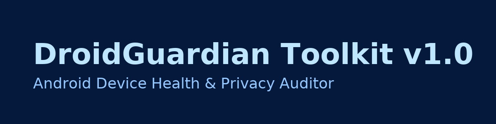

# DroidGuardian Toolkit v1.0 🛡️  
Android Device Health, Security & Privacy Auditor (Termux)

[](https://github.com/xbustcodex/DroidGuardian-Toolkit-v1.0)
[](#)
[](#)
[](LICENSE)

**DroidGuardian Toolkit** is a high-level Android auditing toolkit that runs inside **Termux**.  
It focuses on **device health, security posture and privacy permissions** — completely **read-only** and safe.

No exploits, no payloads, no modifications.  
Just **clear reports** so you can decide what to fix.

---

## ✨ Features

### 📝 Device overview
- Model, manufacturer, device codename  
- Android version & SDK level  
- Security patch level & build ID  
- Verified boot state & basic bootloader hints  
- Google Play Store / Play Services presence

### 🔐 Root & security check (heuristic only)
- Detects `su` binary in common locations  
- Detects Magisk-related packages (if present)  
- Prints simple security recommendations  
- **Does not root or modify your device**

### 👁 Privacy permissions scan (user apps only)
Scans **user-installed apps** for sensitive permissions, including:

- `CAMERA` / `RECORD_AUDIO`  
- `ACCESS_FINE_LOCATION` / `ACCESS_COARSE_LOCATION`  
- `READ_CONTACTS` / `READ_SMS` / `SEND_SMS`  
- `READ_CALL_LOG` / `READ_CALENDAR`  
- `READ_EXTERNAL_STORAGE` / `WRITE_EXTERNAL_STORAGE`

Helps you spot **over-privileged apps** that can see too much.

### 💾 Storage health report
- `df -h` filesystem usage (internal, SD, etc.)  
- Top 15 largest user APKs by size  
- Cleanup tips (uninstall unused apps, clear cache, move media, etc.)

### 🌐 Network snapshot
- Active interfaces (`ip addr` / `ifconfig`)  
- Routing table (`ip route` / `netstat`)  
- Basic DNS info where available

### 🧩 Full audit mode
Runs **all** checks in one go and stores reports under a timestamped folder.

All reports are plain text files stored under:

```text
~/droidguardian_reports
---

📥 Requirements

Android phone or tablet

Termux (F-Droid build recommended)

Basic Termux tools:


pkg update && pkg upgrade -y
pkg install -y bash coreutils termux-tools

For better network info:

pkg install -y iproute2


---

🚀 Installation

Inside Termux:

cd ~
curl -O https://raw.githubusercontent.com/xbustcodex/DroidGuardian-Toolkit-v1.0/main/droidguardian.sh
chmod +x droidguardian.sh

Run it:

bash droidguardian.sh

Optional alias:

echo 'alias droidguardian="bash ~/droidguardian.sh"' >> ~/.bashrc
source ~/.bashrc

Now you can just type:

droidguardian


---

🎛 CLI Usage

You can either use the interactive menu or call specific modules:

bash droidguardian.sh           # interactive menu
bash droidguardian.sh menu      # interactive menu
bash droidguardian.sh overview  # device overview report
bash droidguardian.sh security  # root & security heuristic report
bash droidguardian.sh privacy   # privacy permissions scan
bash droidguardian.sh storage   # storage health report
bash droidguardian.sh network   # network snapshot
bash droidguardian.sh audit     # full audit (all of the above)

Reports are saved under:

~/droidguardian_reports

Each run adds timestamped files so you can compare audits over time.
